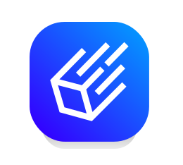

    

# Welcome to the unofficial iced-rs guide 

Iced is an Open Source GUI library written in rust to create beautiful and minimal cross platform applications. It leverages the power of Google's [Skia](https://skia.org/) (via [tiny-skia](https://github.com/RazrFalcon/tiny-skia)) for software rendering and wGPU for hardware rendering. 
It can render beautiful UI while maintaining clean and maintainable code by using the ELM (or MVU) architecture.

Iced focuses on Simplicity and type-safety so that you can concenterate on your implementation without any framework specific distractions.

This guide tries to explain the basics of the Iced GUI library (*mostly* 0.13.1) for the Rust programming language.

Most of the discussions and community talk are centered around the [iced discord](https://discord.gg/3xZJ65GAhd). If you want to talk with people about iced, that's probably the best place.
If you do not like discord, there is a [discourse](https://discourse.iced.rs/) as well.

## Disclaimer

To make it clear at the beginning. This is not an official guide. It is not approved by the iced-rs team!
If you search for the [official documentation](https://docs.rs/iced/latest/iced/) or [iced book](https://book.iced.rs/) take a look at the [Iced website](https://iced.rs/).

## Different versions

Since iced develops quite fast you might encounter big breaking changes in different versions including between the latest version and the master branch (dev version).
A lot of people on the [discord](https://discord.gg/3xZJ65GAhd) use the master branch and talk about features in it, so keep that in mind if you do not find them in the latest release.

## Documentation Resources

You will find docs of the released iced versions here on [docs.rs](https://docs.rs/iced/latest/iced/). 
If you want to see the docs of the master branch (dev version) you can get them [here](https://docs.iced.rs/iced/).
There are a lot of small examples available in the example's directory of the iced repo. But make sure you select the proper git tag/branch for the iced version that you use.

Since the last version, there is also a new, great [pocket guide](https://docs.iced.rs/iced/#the-pocket-guide) that I advise everyone to read.

Some large structural changes are discussed and proposed in rfc's that can be found in the [rfcs repository](https://github.com/iced-rs/rfcs). 
If you are wondering when and what new features are planned, you can take a look at the [roadmap](https://whimsical.com/roadmap-iced-7vhq6R35Lp3TmYH4WeYwLM).

## Other Learning Resources

There are multiple guides and tutorials that help you to learn iced, including this guide and the [official book](https://book.iced.rs/).
Here is a list of other cool resources that you might find helpful:
- [awesome-iced](https://github.com/iced-rs/awesome-iced): a list of applications that use iced
- [Github Markdown Tutorial](https://github.com/fogarecious/iced_tutorial/tree/main): A very large tutorial covering a lot of stuff, but a bit out of date.
- [Youtube Text Editor Tutorial](https://www.youtube.com/watch?v=gcBJ7cPSALo): This is a tutorial on how to build a text editor with iced 0.10, so pretty out of date. It is still a good video tutorial, but a lot of the stuff won't work in the latest iced version and can be done way easier with newer versions.
- Example Applications that show how to structure larger apps
  - [icebreaker](https://github.com/hecrj/icebreaker): An application that shows great how a larger application can be made
  - [iced_receipts](https://github.com/airstrike/iced_receipts): A small app that shows advanced structural patterns for iced applications

## Other Crates

A list of other crates that you might find helpful while creating a gui with iced.

> **Caution:** since iced evolves pretty fast, keep in mind that the following crates might be for different versions of iced and thus incompatible with the version that you are using 

- [iced_aw](https://github.com/iced-rs/iced_aw): Additional widgets from the community
- [rfd](https://docs.rs/rfd/latest/rfd/index.html): Pop-ups and file dialogs
- [plotters-iced](https://github.com/Joylei/plotters-iced): Plotters backend for iced - for Plotting data
- [dragking](https://github.com/airstrike/dragking): Provides a column and row where the user can drag the items around
- [sweeten](https://github.com/airstrike/sweeten): sweeten your daily iced brew
- webview
    - [LegitCamper/iced_webview](https://crates.io/crates/iced_webview): A webview widget for Iced using the Ultralight/Webkit browser engine (notably the licence of the browser engine can be restrictive depending on your use case)
    - [csmoe/iced-webview](https://github.com/csmoe/iced-webview): A webview widget based on the chromium embedded framework
- [iced_divider](https://github.com/icedpygui/iced_divider): "An Iced widget used to change the size of adjacent containers using the mouse horizontally or vertically."
- [modav_widgets](https://github.com/EmmanuelDodoo/modav_widgets/tree/main): custom widgets and experimental UI components for the [modav project](https://github.com/EmmanuelDodoo/modav) (very nice table and tree view widget)
- [iced_toasts](https://crates.io/crates/iced_toasts): add-on crate to provides a simple way to add toast notifications
- [iced_dialog](https://github.com/pml68/iced_dialog/tree/master): provides a native, customizable message dialog widget
- [iced_split](https://github.com/edwloef/iced_split): split widgets (vertical and horizontal draggable splits)
- [iced_audio](https://github.com/iced-rs/iced_audio): Helpful widgets for audio applications (although unmaintained, and still on iced 0.9 and pretty out of date)
- [fluent_iced_gallery](https://github.com/frgp42/fluent_iced_gallery/tree/master): Showcases a sample of widgets styled according to fluent design principles
- [iced_drop](https://github.com/jhannyj/iced_drop): A small library which provides a custom widget and operation to make drag and drop easier to implement
- [iced_table](https://github.com/tarkah/iced_table): A table widget
- [iced_custom_highlighter](https://github.com/pml68/iced_custom_highlighter): A custom syntax highlighter that uses the colors from your app's Theme
- [iced_term](https://github.com/Harzu/iced_term/tree/master): Terminal emulator widget powered by ICED framework and alacritty terminal backend
- [frostdbyte_terminal](https://github.com/Rahn-IT/frostbyte_terminal/tree/master): A terminal widget with customizable datastream
- [slippery](https://github.com/peterkrull/slippery): A slippy map widget for the Iced toolkit
- [iced_gif](https://github.com/Redhawk18/iced_gif): A gif widget for iced
- [iced_palace](https://github.com/hecrj/iced_palace): A royal collection of exquisite widgets and helpers to rule your iced kingdom 

## Contribution

If you want to contribute to this guide, you can open an issue on GitHub and make a pull request. 
For large changes, it is preferred that you open an issue first to discuss the changes. 
For any small changes, spelling, grammar and formatting fixes, directly opening a pull request should not be a problem.

&copy; Héctor Ramón ([hecrj](https://github.com/hecrj)) for the iced logo.
