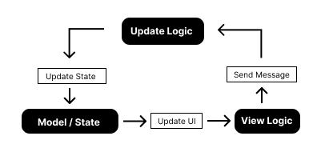

# Architecture
The architecture of iced is inspired by the [elm architecture](https://guide.elm-lang.org/architecture/).
This architecture splits your code into 4 main parts:

- Messages
- Sate
- Update Logic
- View Logic

&nbsp;

<div align="center">
    
</div>

## State
The state contains all the data that your program wants to store throughout its lifespan. This is implemented using a struct. For example, in case of a simple counter app, which increments or decrements the current count value, the state would be like this,

```rust,ignore
struct Counter {
    count: i32
}
```
In the above snippet, all we need is a `count` value for a simple counter application. hence the state.

## Message
The message defines any events or interactions that your program will care about. 
In iced, it will be implemented using the rust enum. For example, let's take a simple counter app, the Messages / Events that might occur are stored in the Message enum, For example, 

```rust,ignore
enum Message {
    IncrementCount,
    DecrementCount
}
```

## Update Logic
The update logic is called every time a message is emitted and can operate based on this message. This logic is the only one that can change the state of your application. A rough example of update logic with respect to the previous counter example is below,

```rust,ignore
fn update(message: Message) {
    match message {
        Message::IncrementCount => count += 1,
        Message::DecrementCount => count -= 1
    }
}
```

## View Logic
The view logic generates the view, elements/widgets, and layout based on the current state. The view logic is called every time after the update logic is called. So for a simple counter app, all we need is a `text` view and two `button`s. We can declare our UI as follows,

```rust,ignore
fn view() {
    let ui = widget::column![
        widget::button("+").on_press(Message::IncrementCount),
        widget::text(count),
        widget::button("-").on_press(Message::DecrementCount)
    ]
}
```

> **_Note:_** The snippets shown above are just for example purposes and will not compile.

Now that we got a basic understanding of the ELM architecture, we can deep dive into Iced and create a simple **counter** app.