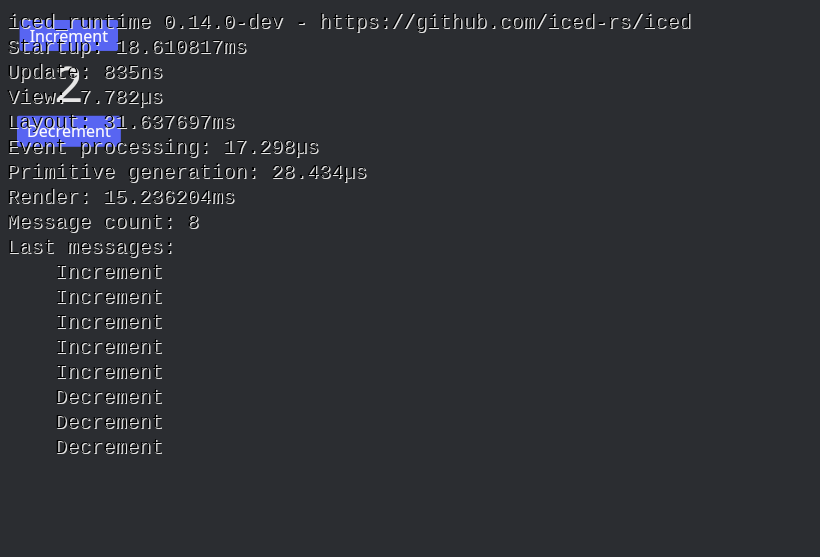

# Debug Mode

If you want to optimize your app, measure performance, or debug issues, you might want to use debug mode.

It provides access to information such as:  
- Startup time  
- Update timings  
- View timings  
- Layout timings  

To enable it, add the Cargo feature `debug` to the iced dependency and run your application.  
To activate debug mode, simply press `F12`.  

In the top-right corner, you should see the debug information displayed like this:

