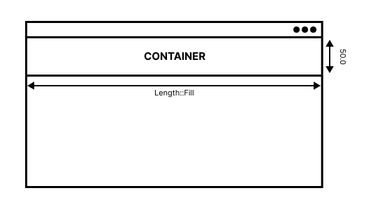
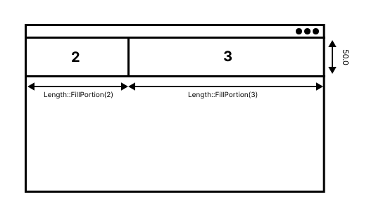

# Length

[`Length`](https://docs.rs/iced/0.14/iced/enum.Length.html) is used to fill space in a specific dimension. The `Length` enum also has capablities of being responsive.

The `Length` enum has the following variants:
- `Length::Fill`
- `Length::FillPortion(u16)`
- `Length::Shrink`
- `Length::Fixed(f32)`

## 1. `Length::Fill` variant
[`Length::Fill`](https://docs.rs/iced/0.14/iced/enum.Length.html#variant.Fill) is used to set a widget's width or height to fill the viewport. For example, setting a `container`'s `width` property to `Length::Fill` will set the `container`'s width to fill the available space.

```rust
let ui = container(...)
    .width(Length::Fill)
    .height(50.0);
```
This will result in the following,

<div align="center">
    
</div>


## 2. `Length::FillPortion(u16)` variant
[`Length::FillPortion(u16)`](https://docs.rs/iced/0.14/iced/enum.Length.html#variant.FillPortion) is used to set width or height to a collection of widgets in a specified ratio. This enum is mostly used in collection widgets such as `row` or `column`.

`Length::Fill` is equivalent to `Length::FillPortion(1)`.

Let’s say we have two elements: one with `FillPortion(3)` and one with `FillPortion(2)`. The first will get 2 portions of the available space, while the second one would get 3. So basically, the two elements will get it's portions in the ratio of 3:2.

```rust
let my_row = row![
    container(...)
        .width(Length::FillPortion(2)),
    container(...)
        .width(Length::FillPortion(3)),
].height(50.0)
```
This will result in the following,

<div align="center">
    
</div>

## Shrink
[`Length::Shrink`](https://docs.rs/iced/0.14/iced/enum.Length.html#variant.Shrink) is used to set the minimum length that an element needs to be properly displayed. This length will be independent from anything else. For example, a container will take the length of it's child element. If the inner element is `Fill`, it will collapse under the outer `Shrink`.

## Fixed
[`Length::Fixed(f32)`](https://docs.rs/iced/0.14/iced/enum.Length.html#variant.Fixed) is used to set a fixed length. This length will be independent from anything else.

```rust
Length::Fixed(15.0)
```
```rust
Length::from(15.0)
```
```rust
Length::from(15)
```
