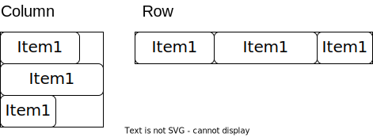
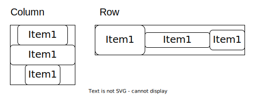
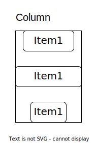

# Columns and Rows

The two most important structs for laying out widgets are [`Column`](https://docs.rs/iced/latest/iced/widget/struct.Column.html) and [`Row`](https://docs.rs/iced/latest/iced/widget/struct.Row.html).

Both lay out their children in one direction. The column organizes the widgets vertically and the row horizontally.



By default, they align the items in the top left corner of their space.

A convenient way to create columns and rows is with the [`column!`](https://docs.rs/iced/latest/iced/widget/macro.column.html) and [`row!`](https://docs.rs/iced/latest/iced/widget/macro.row.html) macros.

We saw one of them in the [Minimal Application - Counter](../quickstart/3_a_simple_counter_app.md).
```rust
{{#rustdoc_include ../quickstart/snippets/main.rs:row}}
```
There, we created a [`Column`](https://docs.rs/iced/latest/iced/widget/struct.Column.html) with three children inside. One text and two buttons. The syntax for rows is the same.

You can put any [`Element`](https://docs.rs/iced_core/0.10.0/iced_core/struct.Element.html) inside a [`Column`](https://docs.rs/iced/latest/iced/widget/struct.Column.html) or [`Row`](https://docs.rs/iced/latest/iced/widget/struct.Row.html).

## Alignment

Of course, we can change the horizontal alignment for columns and the vertical alignment for rows.



This is how they would align in the center.

In code, if you want to set the [`Alignment`](https://docs.rs/iced/latest/iced/enum.Alignment.html) you can call the [`align_x`](https://docs.rs/iced/latest/iced/widget/struct.Column.html#method.align_x) method on your column/row. It will return itself with the new alignment.
```rust
let some_column = iced::widget::column![
    iced::widget::text("Hello World!"),
    iced::widget::text("Another Hello World!")
].align_x(iced::Alignment::Center)
```

## Spacing

Because you cannot set margins in Iced and often want to add space between elements.

Columns and rows provide a [`spacing`](https://docs.rs/iced/latest/iced/widget/struct.Column.html#method.spacing) method to control the gap/spacing.

Below is an example of how to use spacing on a column:
```rust
let some_column = iced::widget::column![
    iced::widget::text("Hello World!"),
    iced::widget::text("Another Hello World!")
].spacing(20)
```



## Wrapping

Rows offer a feature that columns don't—they can wrap their children elements onto new lines. You enable this by calling the `.wrap()` method on a row.

Once wrapping is activated, the layout of the row’s children changes. If the available horizontal space fills up, any extra children automatically move to a new row below.
Additionally, children with a width set to `Fill` or `FillPortion` expand to take up any remaining horizontal space, which can trigger a row break. In contrast, children with fixed or shrink widths continue to be placed side by side until there isn’t enough space, at which point they break onto a new row.
