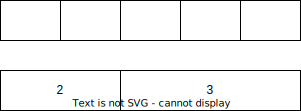

# Length

[`Length`](https://docs.rs/iced/latest/iced/enum.Length.html) is used for width and height in iced.

## Fill and FillPortion
[`Length::FillPortion`](https://docs.rs/iced/latest/iced/enum.Length.html#variant.FillPortion) is used to set the length relative to other elements.

If you have two elements, one with two portions and one with three. The Space gets divided into 5 (2 + 3) equally parts. 
The Length of the `FillPortion(2)` is that space times 2 and the Length `FillPortion(3)` will take that space times 3.



[`Length::Fill`](https://docs.rs/iced/latest/iced/enum.Length.html#variant.Fill) is just an equivalent for `Length::FillPortion(1)`.

## Shrink
[`Length::Shrink`](https://docs.rs/iced/latest/iced/enum.Length.html#variant.Shrink) is used to set the minimum length that an element needs to be properly displayed. This length will be independent from anything else.

## Fixed
[`Length::Fixed(f32)`](https://docs.rs/iced/latest/iced/enum.Length.html#variant.Fixed) is used to set a fixed length. This length will be independent from anything else.

```rust,ignore
Length::Fixed(15.0)
```
```rust,ignore
Length::from(15.0)
```
```rust,ignore
Length::from(15)
```