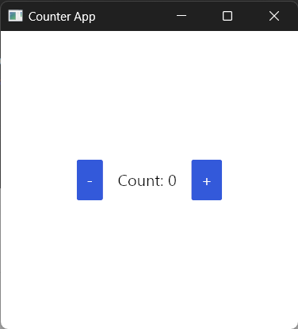

# A minimal Application - Counter

Our goal is to create a simple counter where we have a number displayed that we can increase or decrease with two buttons.

<div align="center">
    
</div>

## Creating a new Project 
First of all, make sure *Rust* is installed in your system. If not head over to [Rust Installation Page](https://www.rust-lang.org/tools/install).

After installing rust, create a new binary crate by executing,
```console
$ cargo new counter-app-iced
$ cd counter-app-iced
```

Add Iced crate by executing,
```console
$ cargo add iced
```

Now, build the app using
```console
$ cargo run
```

On successful build, you can see the text `Hello World` is printed on console. Now we are ready to create our beautiful GUIs using Iced.

## 1. Defining the State
For the state, we define a struct. For the counter, we need to store the current value of the counter.
```rust,ignore
{{#rustdoc_include main.rs:counter_struct}}
```

## 2. Defining the Message
For our counter, we have two major events that matter to us. Increasing and decreasing the counter.

The message is represented as an enum with two variants, `IncreaseCounter` and `DecreaseCounter`.

```rust,ignore
{{#rustdoc_include main.rs:message_enum}}
```

## Implementing the Sandbox for Counter
To create a window, we implement the [`Sandbox`](https://docs.rs/iced/latest/iced/trait.Sandbox.html) trait for our `Counter`. There are two different windowing implementations. One is `Sandbox` and the other is [`Application`](https://docs.rs/iced/latest/iced/application/trait.Application.html). The difference between both is that `Sandbox` trait provides a much simpler interface to work with if you are just getting started.

It's not harder to switch your app from `Sandbox` to `Application`. We will use the `Sandbox` trait throughout this section.

The `Sandbox` trait implments the following,

```rust,ignore
pub trait Sandbox {
    type Message: Debug + Send;

    // Required methods
    fn new() -> Self;
    fn title(&self) -> String;
    fn update(&mut self, message: Self::Message);
    fn view(&self) -> Element<'_, Self::Message>;

    // Provided methods
    fn theme(&self) -> Theme { ... }
    fn style(&self) -> Application { ... }
    fn scale_factor(&self) -> f64 { ... }
    fn run(settings: Settings<()>) -> Result<(), Error>
       where Self: 'static + Sized { ... }
}
```

### Message
At first, we define the message type of our application:
```rust,ignore
{{#rustdoc_include main.rs:counter_message_type}}
```

### New Instance and Title
We also need to define how a new `Counter` is created and what the window title will be:
```rust,ignore
{{#rustdoc_include main.rs:new_and_title}}
``` 
Here in `new` we specify that a new Counter will have an initial `number` value of 0. The window title will be `Window Title`.

### Update logic
Now we can create the update logic for our counter:
```rust,ignore
{{#rustdoc_include main.rs:update}}
```
If the `message` is `Message::IncreaseCounter` we add one to the number stored in our state. If the `message`  is `Message::DecreaseCounter` we subtract one.

### View logic
The only thing left for our `Counter` is the view logic.
```rust,ignore
{{#rustdoc_include main.rs:view}}
```
Here we are using the `column!` macro to create a [`Column`](https://docs.rs/iced/latest/iced/widget/struct.Column.html). This column will distribute the items vertically.

> Note: We convert the column with the `into` to  `iced::Element<'_, Self::Message>`


In this column, we have tree items, one text item, and two buttons.

```rust,ignore
{{#rustdoc_include main.rs:view_text}}
```
We set the content of the text to the number stored in our state.

```rust,ignore
{{#rustdoc_include main.rs:view_buttons}}
```
The [`buttons`](https://docs.rs/iced/latest/iced/widget/struct.Button.html) have the text `Increase` and `Decrease`. 
For both, we specify what should happen when they get pressed.
If the increase button is pressed, `Message::IncreaseCounter` will be emitted. For the decrease button `Message::DecreaseCounter`.

Now we have built our counter app. The only thing left is to run it.

## Running the Counter
Now we can run the Counter. The run method is a default implementation of the [`Sandbox`](https://docs.rs/iced/latest/iced/trait.Sandbox.html) trait.  
```rust,ignore
{{#rustdoc_include main.rs:main}}
```